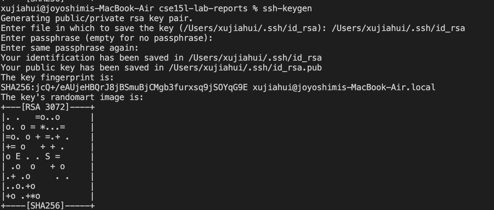

##Installing VScode
The first step is to install Visual Studio Code, which can be found on 
[VS link](https://code.visualstudio.com/)
After install VSC successfully, it should look like this

##connect to the server
The second step is to connect to the server. 
In order to connect successfully, I need to change my 15L account password. 
The link is here [password change](https://sdacs.ucsd.edu/~icc/index.php)
Then I opened a terminal in VSC and used typed following command to log in with my account: 
```
ssh cs15lwi22aqz@ieng6.ucsd.edu
```
Type in the password when it ask for it. After connect to the server, it look like this

##trying some commands
The third step is to try out a few commands as shown on the screenshot:
```
Cd  //takes me to the home directory
Ls //lists all the files in current directory
Ls -lat //lists all the files with more information
Ls -a //list all the files including hidden files
```

##Moving Files with scp
The next step is to move file with the scp command. I created a file called WhereAmI.java in my laptop and copied it to the server with the following command:
```
scp WhereAmI.java cs15lwi22aqz@ieng6.ucsd.edu:~/
```
(password required). 
After this we can log in with ssh again and use ls to found out that the file got copied there.

##Setting an SSH Key
To avoid keep typing password, I can create SSH keys to skip this step. I generate the key with the following command:
```
ssh-keygen
```

Then I create a new folder on the server and copyed the public key onto it
```
mkdir .ssh
exit
scp Users/xujiahui/.ssh/id_rsa.pub cs15lwi22aqz@ieng6.ucsd.edu:~/.ssh/authorized_keys
```

##Optimizing Remote Running
Finally, I used a few trick to make the process even easier.I can use arrow key to recall previous command instead of typing them, I can also put command I want to run on the server after the ssh command to automatically log out after it's done.
