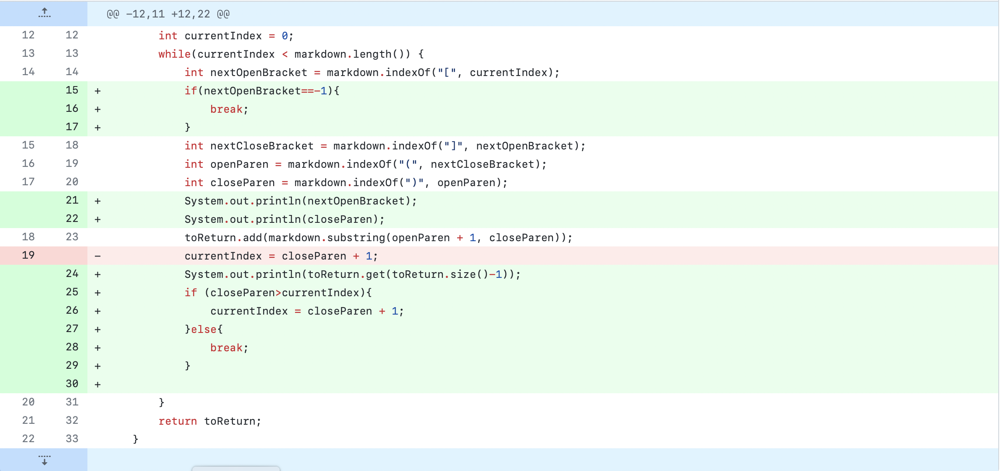
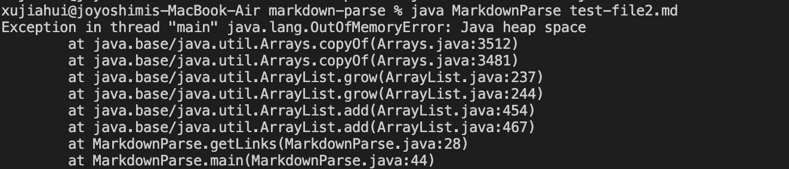
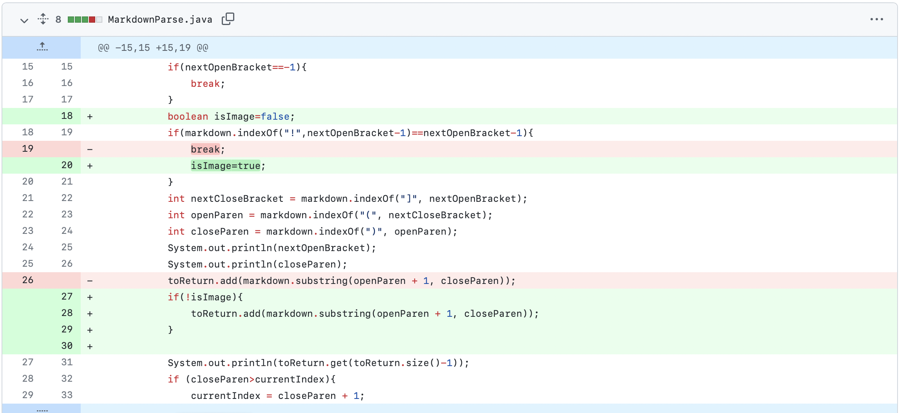
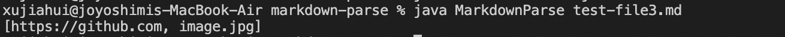
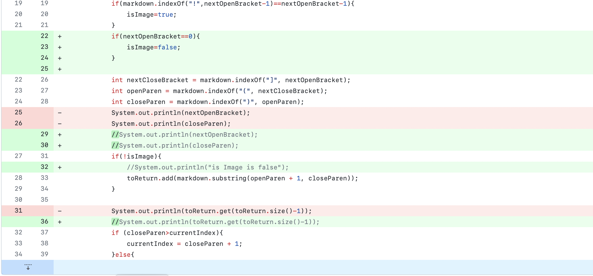
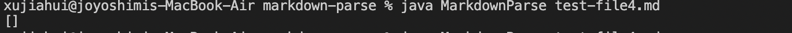

# Week 4 Lab Report
### bug fix 1

The linke to the failure-inducing input:
[test file 2](https://github.com/HenryXII/markdown-parse/blob/main/test-file2.md)

The corresponding symptom

Description of relationship between bug, symptom, and input for bug/input 1: The symptom shows an out of memory error, which imply that the program goes into an infinite loop. When I check the code I found the bug is that the loop can only end if a close paren is at the end of the input file, which is not the case for test file 2. To fix it, I added an if statement that ends the loop if there is no more open bracket.
### bug fix 2

The linke to the failure-inducing input:
[test file 3](https://github.com/HenryXII/markdown-parse/blob/main/test-file3.md)

The corresponding symptom

Description of relationship between bug, symptom, and input for bug/input 2: The symptom is that the link of an image also got printed. This happened because there is an image link in the input file. The bug is that the code couldn't distinguish the difference between an image link or a normal link. To fix it, I added code to check for the ! mark as a signal for image and skip it if thats the case.
### bug fix 3

The linke to the failure-inducing input:
[test file 4](https://github.com/HenryXII/markdown-parse/blob/main/test-file4.md)

The corresponding symptom

Description of relationship between bug, symptom, and input for bug/input 3: The symptom is that the link at the beginning is not getting printed. The input has a link at the beginning. The bug is created by the fix to previous problem, apparently a link at the beginning got treated like an image, the index of the first paren minus one(where might be a ! in the check image logic) is -1, which is the same as the return value when function indexOf couldn't find a !. To fix it, I add a line that assert if the open paren is at index 0, it is not an image.
