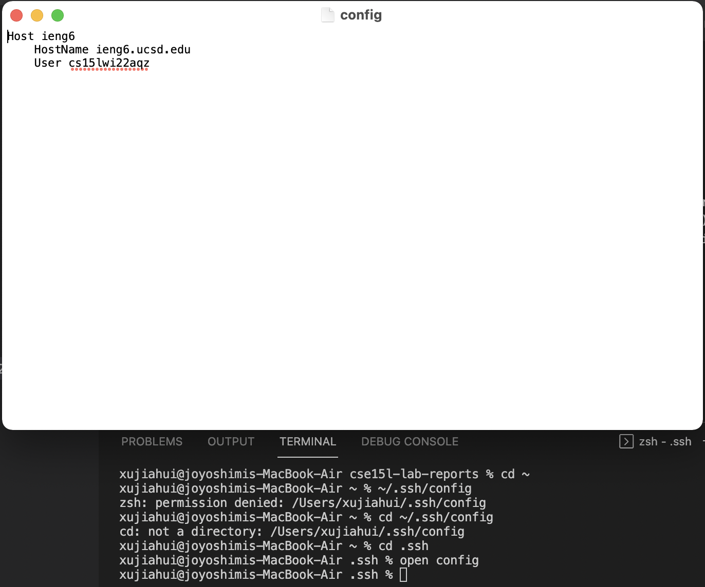
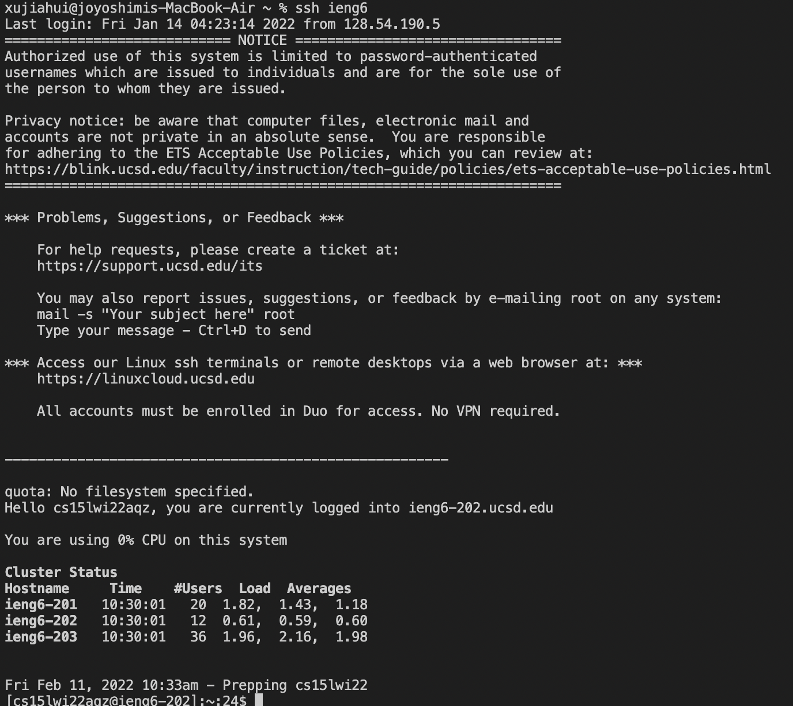
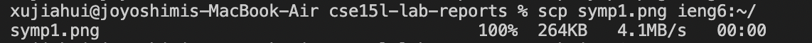

# week 6 lab report
## set up ssh Configuration
The first step is to create a congif file under .ssh directory.
Type in following info like the screen shot shows:
```
Host ieng6
    HostName ieng6.ucsd.edu
    User cs15lwi22zzz (use your username)
```

## easy log in
After setting up config file I can now log into the server by merely:
```
ssh ieng6
```

## easy copy
I can also use the new alias with the scp command. Here is an example and screenshot:
```
scp symp1.png ieng6:~/
```

