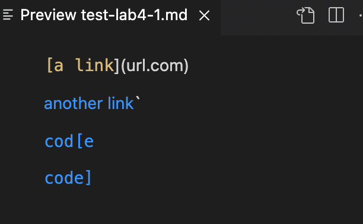
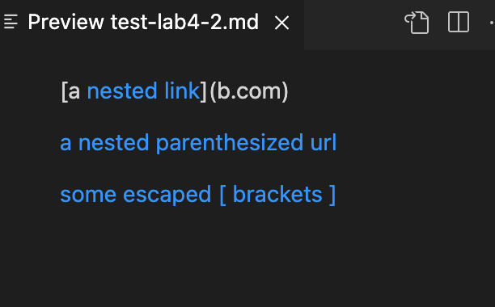
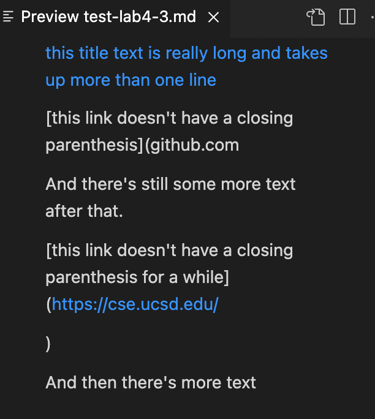

# Week 8 Lab Report

[My Repo](https://github.com/HenryXII/markdown-parse)

[Reviewed Repo](https://github.com/JaredJose/markdown-parse)

## Snippet1
Expected output: [`google.com, google.com, ucsd.edu]




Test code:
```
@Test
    public void testlab1(){
        String fileName="test-lab4-1.md";
        List<String> expected=List.of("`google.com","google.com","ucsd.edu");
        try {
            assertEquals(expected,MarkdownParse.getLinks(Files.readString(Path.of(fileName))));
        } catch (IOException e) {
            // TODO Auto-generated catch block
            e.printStackTrace();
        }  
    }
```
My result:
```
1) testlab1(MarkdownParseTest)
java.lang.AssertionError: expected:<[`google.com, google.com, ucsd.edu]> but was:<[url.com, `google.com, google.com]>
        at org.junit.Assert.fail(Assert.java:89)
        at org.junit.Assert.failNotEquals(Assert.java:835)
        at org.junit.Assert.assertEquals(Assert.java:120)
        at org.junit.Assert.assertEquals(Assert.java:146)
        at MarkdownParseTest.testlab1(MarkdownParseTest.java:77)
```
Reviewed repo result:
```
1) testlab1(MarkdownParseTest)
java.lang.AssertionError: expected:<[`google.com, google.com, ucsd.edu]> but was:<[url.com, `google.com, google.com]>
        at org.junit.Assert.fail(Assert.java:89)
        at org.junit.Assert.failNotEquals(Assert.java:835)
        at org.junit.Assert.assertEquals(Assert.java:120)
        at org.junit.Assert.assertEquals(Assert.java:146)
        at MarkdownParseTest.testlab1(MarkdownParseTest.java:76)
```

## Snippet2

Expected output: [a.com, a.com(()), example.com]




Test code:
```
@Test
    public void testlab2(){
        String fileName="test-lab4-2.md";
        List<String> expected=List.of("a.com", "a.com(())", "example.com");
        try {
            assertEquals(expected,MarkdownParse.getLinks(Files.readString(Path.of(fileName))));
        } catch (IOException e) {
            // TODO Auto-generated catch block
            e.printStackTrace();
        }  
    }
```
My result:
```
2) testlab2(MarkdownParseTest)
java.lang.AssertionError: expected:<[a.com, a.com(()), example.com]> but was:<[a.com, b.com, a.com((, example.com]>
        at org.junit.Assert.fail(Assert.java:89)
        at org.junit.Assert.failNotEquals(Assert.java:835)
        at org.junit.Assert.assertEquals(Assert.java:120)
        at org.junit.Assert.assertEquals(Assert.java:146)
        at MarkdownParseTest.testlab2(MarkdownParseTest.java:88)
```
Reviewed repo result:
```
2) testlab2(MarkdownParseTest)
java.lang.AssertionError: expected:<[a.com, a.com(()), example.com]> but was:<[a.com, a.com((]>
        at org.junit.Assert.fail(Assert.java:89)
        at org.junit.Assert.failNotEquals(Assert.java:835)
        at org.junit.Assert.assertEquals(Assert.java:120)
        at org.junit.Assert.assertEquals(Assert.java:146)
        at MarkdownParseTest.testlab2(MarkdownParseTest.java:87)
```

## Snippet3
Expected output: [https://www.twitter.com, https://ucsd-cse15l-w22.github.io/, https://cse.ucsd.edu/]




Test code:
```
@Test
    public void testlab3(){
        String fileName="test-lab4-3.md";
        List<String> expected=List.of("https://www.twitter.com", "https://ucsd-cse15l-w22.github.io/", "https://cse.ucsd.edu/");
        try {
            assertEquals(expected,MarkdownParse.getLinks(Files.readString(Path.of(fileName))));
        } catch (IOException e) {
            // TODO Auto-generated catch block
            e.printStackTrace();
        }  
    }
```
My result:
```
3) testlab3(MarkdownParseTest)
java.lang.AssertionError: expected:<[https://www.twitter.com, https://ucsd-cse15l-w22.github.io/, https://cse.ucsd.edu/]> but was:<[]>
        at org.junit.Assert.fail(Assert.java:89)
        at org.junit.Assert.failNotEquals(Assert.java:835)
        at org.junit.Assert.assertEquals(Assert.java:120)
        at org.junit.Assert.assertEquals(Assert.java:146)
        at MarkdownParseTest.testlab3(MarkdownParseTest.java:99)
```
Reviewed repo result:
```
3) testlab3(MarkdownParseTest)
java.lang.AssertionError: expected:<[https://www.twitter.com, https://ucsd-cse15l-w22.github.io/, https://cse.ucsd.edu/]> but was:<[]>
        at org.junit.Assert.fail(Assert.java:89)
        at org.junit.Assert.failNotEquals(Assert.java:835)
        at org.junit.Assert.assertEquals(Assert.java:120)
        at org.junit.Assert.assertEquals(Assert.java:146)
        at MarkdownParseTest.testlab3(MarkdownParseTest.java:98)
```

## Possible fix?

For the first snippet, I think it can be solve by keep track of bracket pairs, parenthesis pairs, and back tick pairs. Which one ever comes first will be the one in charge and ignore any symbol between that pair. However, from the second snippet I noticed that only backtick works in a "in charge" way. Symbols in brackets still counts. So it might cause other problems.

For the second snippet, I can't fix it easily. The priority relationship is rather complex. The way to solve it might be ignore nested brackets or nested parenthesis, but recognize nested brackets-parenthesis pair as link.

For the third snippet, It can be fixed by look for next symbol in a wider range, including new lines. Then take off the extra spaces in the link part. It should be plausible within ten lines.


