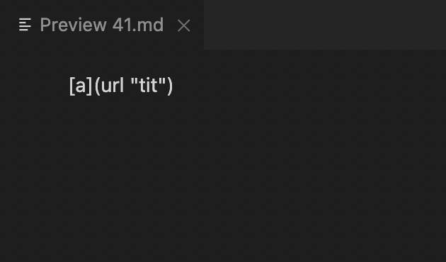
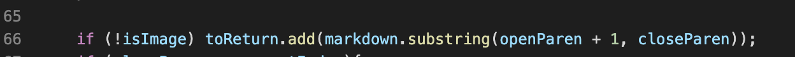
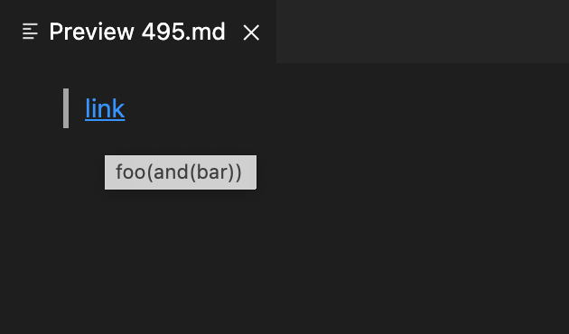

# week 10 lab report 5
## How I found the diffrent results

After I got the two `results.txt` files from running the bash for loop,
I used `diff` command to compare these two files and found the specific tests with different results.

## test case 1

The first test case is `41.md`. I get that the expected output should be `[]` using preview:

And the actual outputs are: `[url &quot;tit&quot;]`(mine), `[]`(Joe's)
So Joe's implementation is correct.

This test case should not be considered as a link because there is space ` ` between parentheses. The bug here is that my implementation doesn't check for space ` ` at all. A possible fix is to check whether there is a space in the link before the add here and only consider the link valid when there is no space ` ` found:

## test case 2

The second test case is `495.md`. I get that the expected output should be `[foo(and(bar))]` using preview:

And the actual outputs are: `[foo(and(bar]`(mine), `[foo(and(bar))]`(Joe's)
So Joe's implementation is correct.

The bug here is that my implementation just use the first close parentheses after the open parentheses as the end of the link, but for markdown file it actually check for match for parentheses. So a possible fix is to keep track of any additional open parentheses before the close parentheses, and skip them until find the one that matches with the first open parentheses that was considered as the begining of the link. The code that needs to be fixed is here:

It should be more complex to find the real pair of parentheses that narks the link